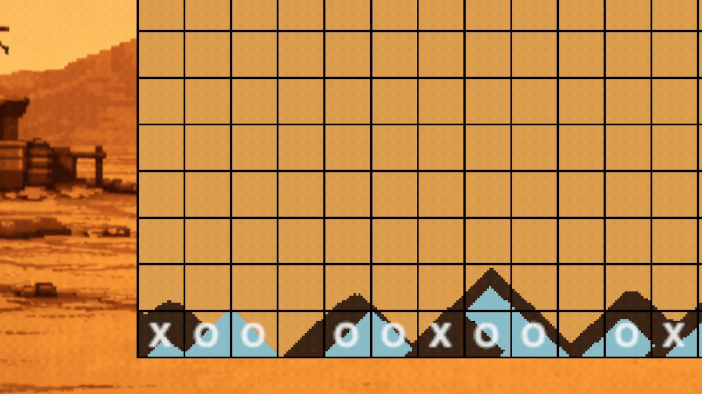
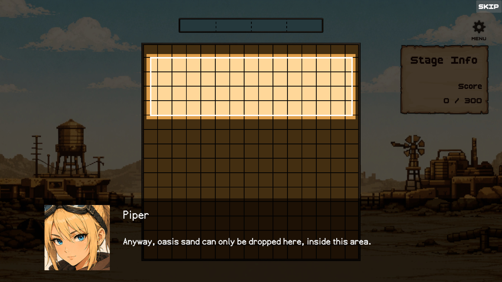
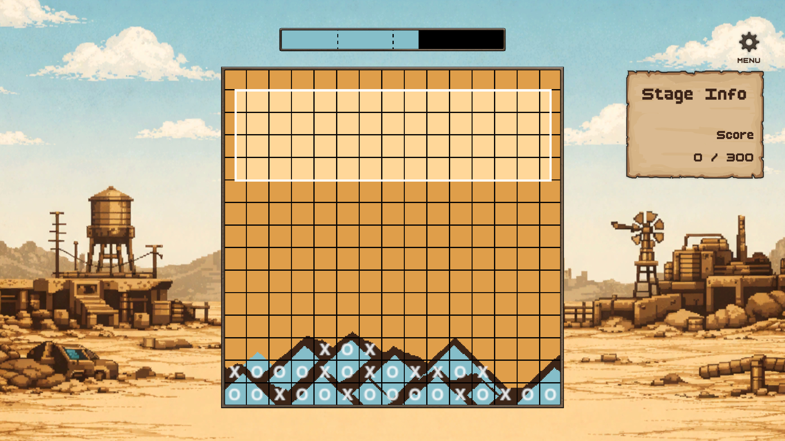
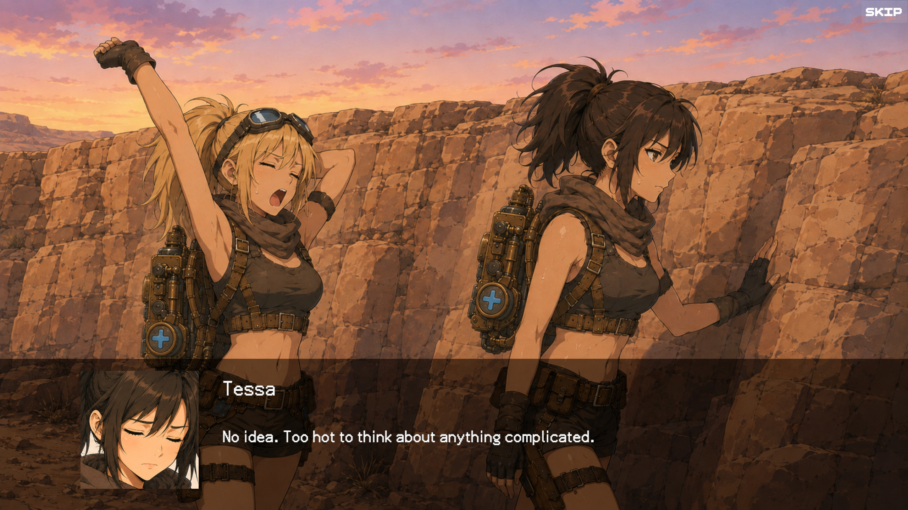
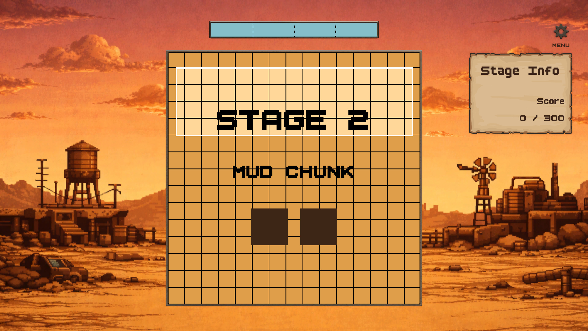
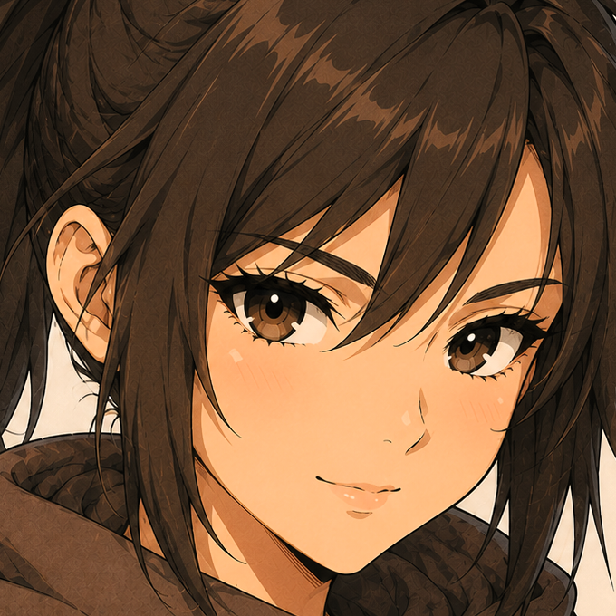
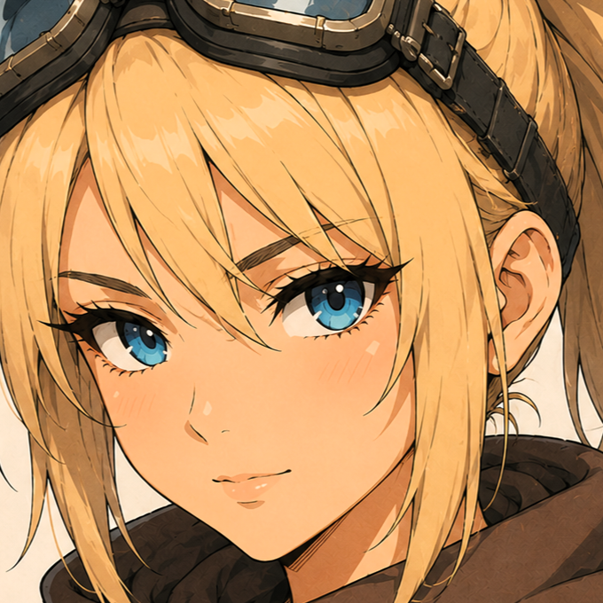

# Sand Bingo

   
  
   

<h3 align="center">Five-in-a-row on a falling-sand board</h3>

   
   
  
  &nbsp;
  
   
   
  
  &nbsp;
  
   
   

## Characters

   
  <table align="center" cellpadding="12">
    <tr>
      <td align="center">
        
        <h3>Tessa</h3>
      </td>
      <td align="center">
        
        <h3>Piper</h3>
      </td>
    </tr>
  </table>

## About

- Genre : Single-player falling-sand puzzle, with visual novel scenes
- Playtime : About 30 minutes
- Stages : Easy, Normal, Hard, and Custom (planned for v1.1)
- Languages : English, Korean
- Release : 2026-08-31 on Steam (planned)
- Development started : 2026-02-09
- Unity version : 2022.3.62f3

## Credits

### Unity Asset Store

- [Dark Brown GUI kit](https://assetstore.unity.com/packages/2d/gui/dark-brown-gui-kit-201086) - ARCEY
- [Fantasy Wooden GUI : Free](https://assetstore.unity.com/packages/2d/gui/fantasy-wooden-gui-free-103811) - Black Hammer
- [BoldPixels Font](https://assetstore.unity.com/packages/2d/fonts/boldpixels-font-332078) - YukiPixels

### Other Assets

- [TerrarumSansBitmap](https://github.com/curioustorvald/Terrarum-sans-bitmap/releases) - CuriousTorvald
- [PF스타더스트](https://m.blog.naver.com/campanula913/221366697603) - 피나타

### Generative AI

- Unity C# scripts : Claude Sonnet 4.5 - 5 (implementation), Claude Opus 4.6 - 5 (optimization)
- Images : GPT Image 2.0 (generation), ~~Claude Opus 4.8 - 5 (prompting)~~
